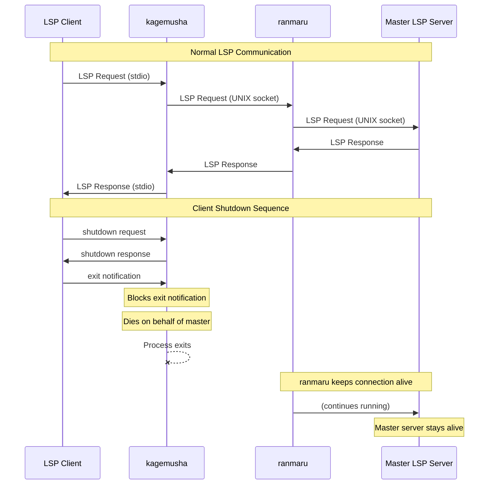

# A Proxy System for Long-Running LSP Servers

This repository includes two proxy server programs for the Language Server
Protocol (LSP): *kagemusha* and *ranmaru*. By combining these programs, you can
connect multiple clients to a single long-running LSP server instance.

Why is this important? Typical language server SDKs such as
[vscode-languageserver](https://github.com/Microsoft/vscode-languageserver-node)
(for Node.js) assume one client per server. When a client disconnects from its
peer, it sends an exit notification to the server, causing the entire
server program to exit. The server SDK also has a built-in watchdog mechanism
that forces the server to exit after the client process ends. This becomes a
limitation when you want to develop a program that serves as an LSP server but also
provides other services such as the Model Context Protocol (MCP), because LSP
client disconnection terminates the entire program.

With *kagemusha* and *ranmaru*, this will no longer be the case. You can develop
a long-running multi-role server that accepts connections from multiple clients
using any of the standard SDKs for developing language servers.

## How it works

> [!IMPORTANT]
> Ranmaru currently supports UNIX domain sockets as the only transport protocol.
> The master language server must support UNIX domain sockets, which is not
> common at present. It would be possible for ranmaru to support other
> transports such as TCP sockets and stdio, but this would be less suitable for
> the intended use cases.

In a typical scenario, *kagemusha* directly interfaces with the LSP client, while
*ranmaru* runs alongside the master LSP server. When the client tries
to kill the LSP server by sending a shutdown request and an exit notification,
*kagemusha* blocks these messages and dies on behalf of the master. Meanwhile,
*ranmaru* sits in front of the master server and behaves as a client to
the server. It stays alive, so the watchdog won't detect any death activity,
allowing the master to continue providing services.



## Prerequisites

Both *kagemusha* and *ranmaru* are written in OCaml 5 and packaged with Nix.
They should run on UNIX-like systems (e.g., Linux and macOS).

If you're using Nix flakes, you can install the programs through the following
packages:

- `github:akirak/kagemusha#kagemusha` for `kagemusha`
- `github:akirak/kagemusha#ranmaru` for `ranmaru`

If you're not using Nix, use Dune to build the programs from source.

# Kagemusha (KAH-geh-moo-shah, 影武者)

> "Shadow warrior" – a political decoy who takes the place of a powerful figure
> to protect them or preserve the illusion of continuity.

> [!IMPORTANT]
> Also check out [the film of the same
> title](https://www.rottentomatoes.com/m/kagemusha) 🍅, directed by the
> legendary Akira Kurosawa (a different Akira K).

`kagemusha` is a forward LSP proxy that prevents shutdown requests and exit
notifications from being sent to the upstream server. It provides the common stdio
interface to communicate with the client and connects to the server over a UNIX
domain (stream) socket.

## Usage

Connect to a UNIX socket server and interact with the client via stdin:

``` shell
kagemusha SOCKET
```

Arguments:

- `SOCKET` is the path to the UNIX domain socket of an LSP server (typically the
`CLIENT` socket of `ranmaru`).

# Ranmaru (RAHN-mah-roo, 蘭丸)

*Mori Ranmaru* (森蘭丸) was a retainer to *Oda Nobunaga* (織田信長). He was a
loyal servant to his master, and they died on the same day when they were
surrounded by rebels, without allowing the rebels to find their bodies.


<!-- The above image is in the public domain. See https://en.wikipedia.org/wiki/Mori_Ranmaru#/media/File:Mori_Ranmaru-Utagawa_Kuniyoshi-ca.1850-_from_TAIHEIKI_EIYUDEN.jpg -->

`ranmaru` is a reverse LSP proxy that accepts connections from multiple clients
over a UNIX domain socket. It survives across client disconnections and
also translates JSON-RPC message IDs to avoid conflicts.

## Usage

Pipe LSP messages between two UNIX sockets:

``` shell
ranmaru CLIENT SERVER
```

Arguments:

- `CLIENT` is the path to the UNIX domain socket that `ranmaru` listens on. It
  should not exist.
- `SERVER` is the path to the UNIX domain socket of the master LSP server. It must
  exist before `ranmaru` starts.
